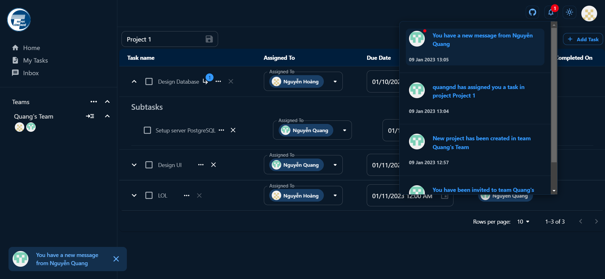

<br />
<div align="center">
  <h3 align="center"><strong>Project Management Web Application</strong></h3>
  <p align="center">
    <a href="https://github.com/hoangndst/pm/issues">Report Bug</a>
  </p>
</div>

<details>
  <summary><strong>Table of Contents</strong></summary>
  <ol>
    <li>
      <a href="#introduction">Introduction</a>
    </li>
    <li>
      <a href="#demo-image">Demo Image</a>
    </li>
    <li><a href="#database">Database</a></li>
    <li><a href="#license">License</a></li>
  </ol>
</details>
<br />

## Introduction

PM - Project Management Application 
## Demo Image




## Database


## Dockerizing
- Create `.env` file in pm-server folder.
  ```
  # .env
  DB_HOST=your_database_host
  DB_USER=your_username
  DB_PASSWORD=your_password
  # This has 2 database. 1 for user data. 1 for authentication.
  DB_DATA_NAME=pm
  DB_AUTH_NAME=pmAuthorization
  # You can config your secret key.
  PM_SECRET=pm-secret 
  PM_REFRESH_SECRET=pm-refresh-secret
  # Config Port
  PORT=3000
  ```
- Build Docker image 
  ``` bash
  docker build . -t <your_username>/pm
  ```
- You can use my image [hoangndst/pm](https://hub.docker.com/r/hoangndst/pm). Port `3000` is not exported by default.

## License
[MIT](https://choosealicense.com/licenses/mit/)